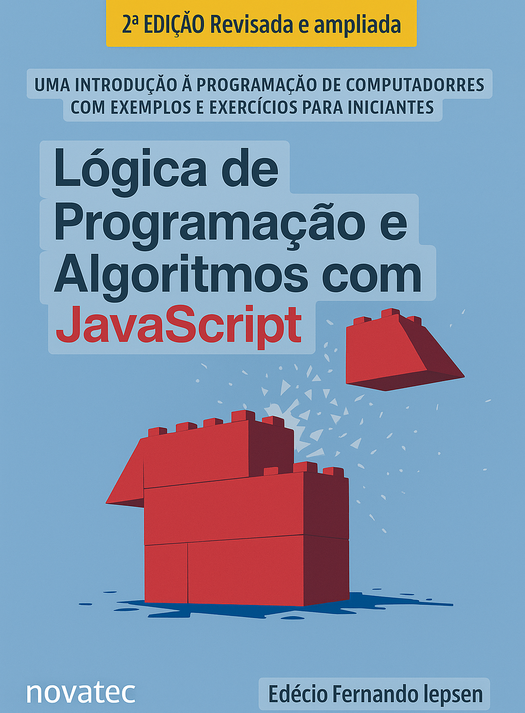

# Livro de Estudo JavaScript

Livro de estudo, utilizando HTML e JavaScript como ponte entre lógica de programação e aplicações reais.📖

      
    
## ✍️ Descrição 

Neste primeiro capítulo, somos introduzidos ao universo da lógica de programação com JavaScript e HTML. O autor, ciente das dificuldades enfrentadas por iniciantes, guia o leitor passo a passo, destacando a importância dos algoritmos e da estrutura lógica nos programas.
      
      
## 🏃‍♂️Objetivo de Estudo

Saída de dados com alert. (ex1_1.html 📁)

Entrada de dados com prompt. (ex1_2.html 📁)

Operações envolvendo string e números. (ex1_3.html 📁)

Tipos de variáveis. (ex1_4.html 📁)

Cálculo do dobro de um número. (ex1_5.html 📁)

Soma de dois números. (ex1_6.html 📁)

Cálculo do valor do jantar. (ex1_7.html 📁)

Cálculo da duração de horas de uma viagem. (ex1_8.html 📁)

  ## 💠Exercícios 

 Elaborar um programão que leia um número. Calcule e informe os seus vizinhos, ou seja, o número anterior e posterior. (resp1_a 📁)

    Exemplo:
    Número: 15
    Vizinhos: 14 e 16

 Elaborar um programa para uma pizzaria, o qual leia o  valor total de uma conta e quantos clientes vão pagá-la. Calcule     e informe o valor a ser pago por cliente. (resp1_b 📁)

    Exemplo: 
    Valor da Conta R$: 90.00
    Número de Clientes: 3
    Valor por Cliente R$: 30.00

 Elaborar um programa para uma loja, o qual leia o preço de um produto e informe as opções de pagamentos da loja. Calcule e informe o valor para pagamentos á vista com 10% de desconto e o valor em 3x. (resp1_c 📁)

    Exemplo:
    Preço R$: 60.00
    Á Vista R$: 54:00
    Ou 3x de R$: 20.00

 Elaborar um programa que leia 2 notas de um aluno em uma disciplina. Calcule e informe a média das notas. (resp1_d 📁)

    Exemplo:
    1ª Nota: 7.0
    2ª Nota: 8.0
    Média: 7.5

## 🗂 Estrutura do Conteúdo
1. Introdução à lógica de programação.
2. Diferença entre lógica e linguagem.
3. Entrada, processamento e saída de dados.
4. Primeiros exemplos em JavaScript.
5. Boas práticas e dicas para iniciantes.

## 👨‍💻 Sobre mim
Sou desenvolvedor Front-End apaixonado por criar interfaces modernas e intuitivas.  
Se quiser trocar ideias ou colaborar em um projeto.

## 📲 Contato

[Github](https://github.com/Horvate)
[Linkdin](https://www.linkedin.com/in/eduardo-horvate/)
[Email](https://mail.google.com/mail/u/0/?tab=rm&ogbl#sent)

##  🧔‍♂️Autor e Créditos

Material baseado no livro Lógica de Programação e Algoritmos com JavaScript, de Edécio Fernando Iepsen.

## 📜 Licença

Este material é apenas para fins educacionais e de estudo.# LivroJs-cap1
# LivroJs-cap1
